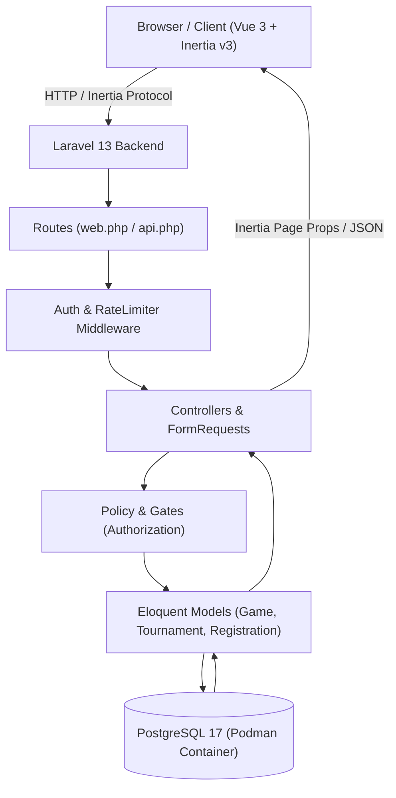
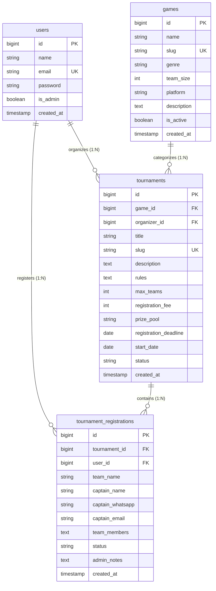

# Sistem Pendaftaran Turnamen Game (E-Sport Tournament Hub)

Mini Project Web Sistem Informasi bertema **Sistem Pendaftaran Turnamen Game** yang dibangun menggunakan **Laravel 13**, **Inertia.js v3**, **Vue 3**, **Tailwind CSS v4**, dan **PostgreSQL (via Podman)** sebagai pemenuhan tugas **UTS Pertemuan 8 - Pemrograman Web 2**.

---

## 📌 1. Latar Belakang, Pengguna, dan Batasan Proyek

### Masalah Nyata
Sebelum adanya sistem ini, pendaftaran turnamen e-sport kampus/komunitas dilakukan secara manual melalui Google Form dan koordinasi via grup WhatsApp. Pendekatan manual tersebut memiliki banyak kendala:
1. **Over-capacity**: Tidak ada validasi real-time saat kuota slot turnamen telah penuh.
2. **Duplikasi Data**: Tim yang sama dapat mendaftar berkali-kali tanpa terdeteksi.
3. **Tracking Status Lemah**: Peserta tidak dapat memantau apakah pendaftaran timnya sudah diverifikasi (`approved`) atau ditolak (`rejected`).
4. **Data Roster Berantakan**: Data in-game nickname dan susunan pemain sulit diperbarui jika ada pergantian pemain sebelum turnamen dimulai.

### Solusi Sistem
Sistem ini menyediakan portal terpusat untuk:
- Mengelola data master game e-sport (Data Pendukung).
- Membuka dan mengatur turnamen game lengkap dengan batas slot, deadline, tanggal tanding, dan prize pool (Modul Utama).
- Alur pendaftaran tim oleh kapten dengan validasi ketat kapasitas slot dan duplikasi nama tim (Alur Utama).
- Panel review dan verifikasi status pendaftaran tim bagi panitia penyelenggara.

### Target Pengguna
1. **Admin / Panitia Penyelenggara**:
   - Mengelola kategori game yang dipertandingkan.
   - Membuat, mengubah, menutup, dan menghapus turnamen game.
   - Meninjau berkas pendaftaran tim peserta dan mengubah status (`approved` / `rejected`).
2. **Peserta / Kapten Tim (User Terautentikasi)**:
   - Melihat katalog turnamen yang tersedia beserta detail regulasi.
   - Mendaftarkan tim dan susunan roster pemain ke turnamen yang masih membuka kuota.
   - Memantau riwayat dan status verifikasi pendaftaran tim.
   - Memperbarui data tim selama status pendaftaran masih dalam tahap verifikasi (`pending`).
3. **Tamu (Guest / Publik)**:
   - Melihat daftar turnamen publik dan informasi detail kompetisi.

### Batasan Proyek (Scope)
- **Dalam Lingkup (In-Scope)**:
  - Autentikasi sesi (Login, Register, Logout) dengan proteksi otorisasi berbasis peran (`is_admin`).
  - CRUD Modul Data Pendukung (`games`).
  - CRUD Modul Data Utama (`tournaments`) dengan filter game & status.
  - Alur Transaksi Pendaftaran Tim (`tournament_registrations`): pendaftaran, perubahan data saat pending, pembatalan, dan persetujuan panitia.
  - Validasi server lengkap (input kosong, batas kuota, referensi FK tidak sah, nama tim duplikat).
  - Empty state UI, loading state, dan flash notification toast.
- **Di Luar Lingkup (Out-of-Scope)**:
  - Payment gateway otomatis (pembayaran diverifikasi manual oleh panitia).
  - Bracket / bagan eliminasi turnamen otomatis.

---

## 🏗️ 2. Arsitektur & Relasi Database (ERD)

### Diagram Arsitektur Aplikasi


### Entity Relationship Diagram (ERD)


---

## 📂 3. Peta Struktur Folder Proyek

```text
pendaftaran_turnamen_game/
├── app/
│   ├── Http/
│   │   ├── Controllers/
│   │   │   ├── TournamentController.php              # Controller CRUD Turnamen (Inertia View)
│   │   │   ├── TournamentRegistrationController.php  # Controller Alur Pendaftaran Tim
│   │   │   ├── GameController.php                    # Controller Master Game
│   │   │   ├── DashboardController.php               # Controller Dashboard & Statistik
│   │   │   └── SessionController.php                 # Controller Login/Logout Sesi
│   │   ├── Middleware/
│   │   │   └── HandleInertiaRequests.php             # Shared flash props & auth state
│   │   └── Requests/
│   │       ├── StoreTournamentRequest.php            # Validasi form tambah turnamen
│   │       ├── UpdateTournamentRequest.php           # Validasi form ubah turnamen
│   │       ├── StoreRegistrationRequest.php          # Validasi form pendaftaran tim & kuota
│   │       └── UpdateRegistrationRequest.php         # Validasi form ubah data tim
│   ├── Models/
│   │   ├── Game.php                                  # Model Data Pendukung
│   │   ├── Tournament.php                            # Model Data Utama
│   │   ├── TournamentRegistration.php                # Model Pendaftaran & Transaksi
│   │   └── User.php                                  # Model User & Otorisasi
│   └── Policies/
│       ├── TournamentPolicy.php                      # Otorisasi manajemen turnamen
│       └── TournamentRegistrationPolicy.php          # Otorisasi pendaftaran tim
├── compose.yml                                       # Konfigurasi Podman/Docker (PostgreSQL + Adminer)
├── database/
│   ├── migrations/                                   # Migrasi tabel games, tournaments, registrations
│   └── seeders/
│       ├── TournamentSeeder.php                      # Seeder akun demo, game, dan turnamen
│       └── DatabaseSeeder.php                        # Runner utama seeder
├── resources/js/
│   ├── pages/
│   │   ├── tournaments/
│   │   │   ├── Index.vue                             # Katalog turnamen (filter, card, empty state)
│   │   │   ├── Show.vue                              # Detail turnamen, rules, tim terdaftar
│   │   │   ├── Create.vue                            # Form tambah turnamen (Admin)
│   │   │   └── Edit.vue                              # Form ubah turnamen (pre-filled data)
│   │   ├── registrations/
│   │   │   ├── Index.vue                             # List pendaftaran tim (Review panitia & peserta)
│   │   │   ├── Create.vue                            # Form pendaftaran tim baru
│   │   │   └── Edit.vue                              # Form ubah pendaftaran tim
│   │   ├── games/
│   │   │   └── Index.vue                             # Master data game e-sport
│   │   └── Dashboard.vue                             # Dashboard statistik turnamen
│   └── components/                                   # UI components (Button, Card, Badge, Modal)
├── routes/
│   ├── web.php                                       # Rute web & alur Inertia
│   └── api.php                                       # Kontrak endpoint REST API
└── tests/Feature/
    └── TournamentSystemTest.php                      # Test suite 12 Kasus Uji (TC-01 s.d. TC-12)
```

---

## 🔐 4. Matriks Pengguna & Hak Akses (Otorisasi)

| Aksi / Fitur | Guest (Publik) | Peserta (User Biasa) | Admin / Panitia |
| :--- | :---: | :---: | :---: |
| Lihat Katalog & Detail Turnamen | ✅ Diizinkan | ✅ Diizinkan | ✅ Diizinkan |
| Mendaftar Tim ke Turnamen Buka | ❌ Redirect Login | ✅ Diizinkan | ✅ Diizinkan |
| Lihat Riwayat Pendaftaran Tim Sendiri | ❌ Ditolak | ✅ Diizinkan | ✅ Diizinkan |
| Ubah Data Tim Sendiri (Status: Pending) | ❌ Ditolak | ✅ Diizinkan | ✅ Diizinkan |
| Ubah Data Tim Sendiri (Status: Approved/Rejected) | ❌ Ditolak | 🚫 403 Forbidden | ✅ Diizinkan |
| Buat / Ubah / Hapus Turnamen | ❌ Ditolak | 🚫 403 Forbidden | ✅ Diizinkan |
| Approve / Reject Pendaftaran Tim | ❌ Ditolak | 🚫 403 Forbidden | ✅ Diizinkan |
| Kelola Master Game | ❌ Ditolak | 🚫 403 Forbidden | ✅ Diizinkan |

---

## 🧪 5. Bukti 12 Kasus Uji (Happy & Negative Path)

Pengujian otomatis dibangun dengan **Pest** pada file [`tests/Feature/TournamentSystemTest.php`](file:///D:/Projects/PHP_Projects/pendaftaran_turnamen_game/tests/Feature/TournamentSystemTest.php):

| Kode | Kasus Uji | Skenario Pengujian | Hasil Pengujian |
| :--- | :--- | :--- | :---: |
| **TC-01** | Login & Logout | Login valid masuk sesi; login salah menampilkan HTTP 401; logout menghapus sesi dan rute protected tidak dapat diakses. | **PASSED (Green)** |
| **TC-02** | Daftar & Empty State | Halaman turnamen menampilkan daftar dari DB; jika filter menghasilkan 0 data, komponen menampilkan ilustrasi empty state yang informatif. | **PASSED (Green)** |
| **TC-03** | Tambah Valid (Pendaftaran) | Input tim valid menghasilkan record baru di tabel `tournament_registrations` dengan relasi FK valid; data tetap ada setelah refresh. | **PASSED (Green)** |
| **TC-04** | Ubah Valid (Edit Tim) | Form ubah memuat data lama (pre-fill); perubahan nama tim dan kontak berhasil disimpan; relasi tournament dan user tidak berubah. | **PASSED (Green)** |
| **TC-05** | Input Kosong / Whitespace | Field wajib kosong atau spasi (nama tim, kontak, email, roster) ditolak server dengan pesan error validasi spesifik. | **PASSED (Green)** |
| **TC-06** | Batas Input (Kuota Penuh) | Turnamen yang kuotanya sudah terisi penuh menolak pendaftaran tim baru dengan pesan bahwa slot turnamen telah habis. | **PASSED (Green)** |
| **TC-07** | Referensi Tidak Sah | Pendaftaran dengan `tournament_id` fiktif yang tidak ada di database ditolak server (tidak terjadi record yatim/rusak). | **PASSED (Green)** |
| **TC-08** | Akses Tanpa Login | Panggilan endpoint `POST /registrations` langsung tanpa sesi autentikasi ditolak dan diredirect ke halaman login; DB tidak berubah. | **PASSED (Green)** |
| **TC-09** | Akses Tidak Berhak | Peserta biasa memanggil aksi `PUT /tournaments/{id}` atau `PATCH /registrations/{id}/status` ditolak dengan kode status **403 Forbidden**. | **PASSED (Green)** |
| **TC-10** | ID Data Tidak Ada | Mengakses detail turnamen dengan ID `999999` menghasilkan respons **404 Not Found** tanpa menimbulkan server error (500). | **PASSED (Green)** |
| **TC-11** | Pencegahan Duplikasi | Dua tim dengan nama yang sama pada turnamen yang sama ditolak server dengan pesan kesalahan validasi unik. | **PASSED (Green)** |
| **TC-12** | Instalasi & Seeding Ulang | Eksekusi `php artisan migrate:fresh --seed` berhasil mengisi database bersih dengan master game, turnamen contoh, dan akun demo. | **PASSED (Green)** |

Jalankan test suite:
```bash
php vendor/pestphp/pest/bin/pest tests/Feature/TournamentSystemTest.php
```

---

## 🚀 6. Panduan Menjalankan di Lingkungan Lokal

### Opsi A: Menggunakan Podman (Direkomendasikan)

1. **Jalankan Container Database PostgreSQL**:
   ```bash
   podman compose up -d
   ```
   *Layanan database aktif:*
   - **Engine**: PostgreSQL 17 (Container: `turnamen_game_db`)
   - **Host / IP**: `127.0.0.1` (atau `localhost`)
   - **Port**: `5432`
   - **Database**: `pendaftaran_turnamen`
   - **Username**: `turnamen_user`
   - **Password**: `turnamen_secret`

   > **Koneksi via HeidiSQL**:
   > Buka HeidiSQL -> Pilih Network type **PostgreSQL** -> Masukkan Hostname `127.0.0.1`, User `turnamen_user`, Password `turnamen_secret`, Port `5432`, dan Database `pendaftaran_turnamen` -> Klik **Open**.

2. **Salin Environment & Generate Key**:
   ```bash
   cp .env.example .env
   php artisan key:generate
   ```

3. **Jalankan Migrasi & Database Seeder**:
   ```bash
   php artisan migrate:fresh --seed
   ```

4. **Kompilasi Frontend Asset (Vite/Vue)**:
   ```bash
   npm run build
   # atau untuk mode development live-reload:
   npm run dev
   ```

5. **Jalankan Server Lokal Laravel**:
   ```bash
   php artisan serve
   ```
   Akses aplikasi di browser: **`http://localhost:8000`**

---

### Opsi B: Tanpa Podman / Container (Menggunakan SQLite Standalone)

Jika tidak ingin menggunakan Podman, Anda dapat beralih ke SQLite tanpa instalasi DBMS tambahan:
1. Di file `.env`, ubah bagian database menjadi:
   ```env
   DB_CONNECTION=sqlite
   ```
2. Buat file SQLite kosong:
   ```bash
   # Windows PowerShell:
   New-Item -ItemType File -Path database\database.sqlite -Force
   ```
3. Jalankan migrasi dan server:
   ```bash
   php artisan migrate:fresh --seed
   php artisan serve
   ```

---

## 👥 7. Kredensial Akun Demo Pengujian

Semua akun demo di bawah ini dibuat otomatis saat menjalankan seeder:

| Peran (Role) | Email | Password | Keterangan |
| :--- | :--- | :--- | :--- |
| **Admin Panitia** | `admin@turnamen.test` | `password` | Memiliki akses penuh membuat turnamen, approve/reject tim, dan kelola game. |
| **Peserta / Kapten 1** | `kapten1@turnamen.test` | `password` | Kapten tim *Garuda Esports* (status: Approved). |
| **Peserta / Kapten 2** | `kapten2@turnamen.test` | `password` | Kapten tim *Evos Junior Reborn* (status: Pending, dapat diuji ubah data). |

---

## ⚠️ 8. Keterbatasan Sistem (Known Limitations)

1. **Format Upload Bukti Pembayaran**: Saat ini pendaftaran turnamen berbayar mencatat nomor kontak dan rekening konfirmasi, belum terintegrasi ke payment gateway otomatis seperti Midtrans/Xendit.
2. **Sistem Bagan (Bracket Match)**: Sistem berfokus pada manajemen pendaftaran dan kualifikasi roster tim. Bagan bagan pertandingan (Single/Double Elimination) belum digenerate secara otomatis di versi UTS ini.
