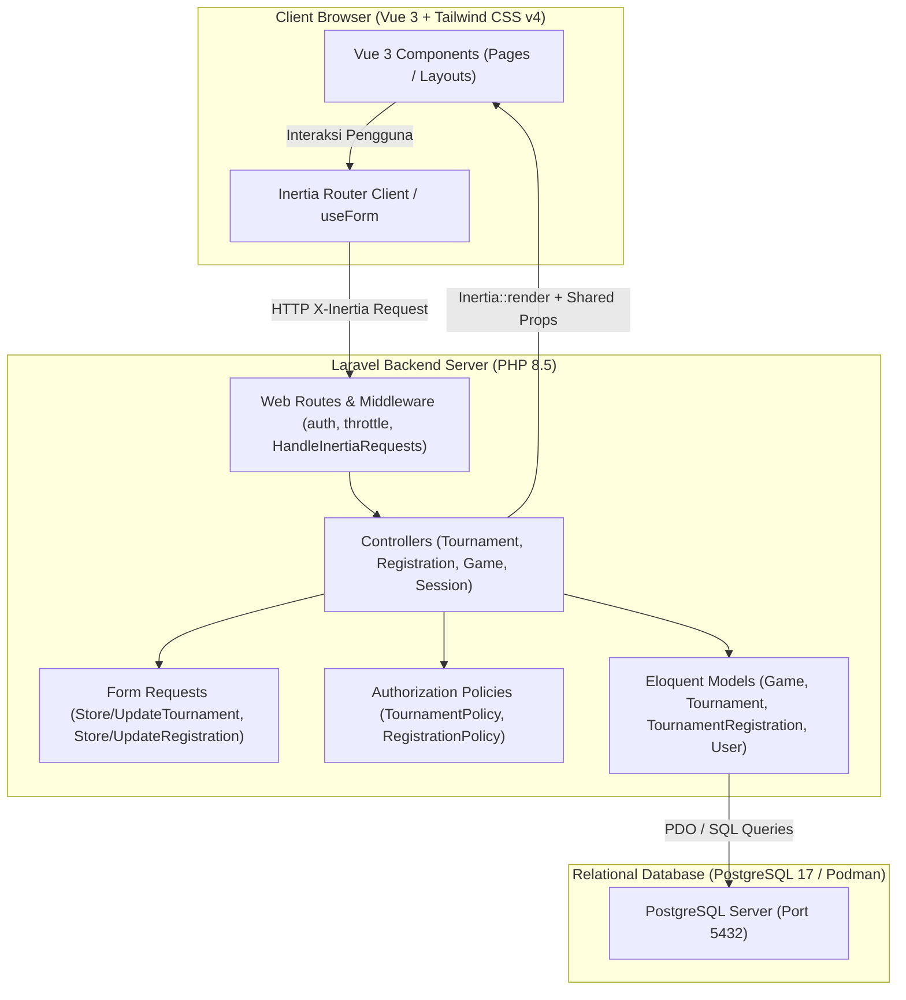
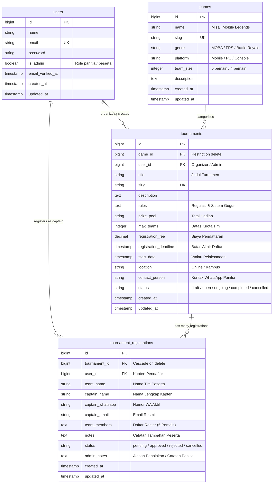

# Rencana & Dokumen Evaluasi UTS Mini Project Web Sistem Informasi
## Tema: Sistem Pendaftaran Turnamen Game (E-Sport Tournament Hub)

Dokumen ini disusun sebagai acuan pengisian lembar kerja UTS **Pertemuan 8 - UTS Mini Project Sistem Informasi (Pemrograman Web 2)** sekaligus hasil audit verifikasi kesesuaian implementasi kode pada repository ini.

---

## 📋 1. Verifikasi Checklist Akhir (Checklist Rubrik Penilaian)

| ID | Item Checklist | Status Implementasi | Bukti Nyata di Kode Sumber |
| :---: | :--- | :---: | :--- |
| **c1** | Tema dan kebutuhan jelas | ✅ **LULUS (100%)** | Tema bebas: *Sistem Pendaftaran Turnamen Game*. Menyelesaikan masalah kuota slot turnamen, validasi duplikasi pendaftaran, dan tracking status verifikasi roster. |
| **c2** | Modul utama dan data pendukung berelasi | ✅ **LULUS (100%)** | Data Pendukung: `Game` (`games`). Modul Utama: `Tournament` (`tournaments`). Alur Transaksi: `TournamentRegistration` (`tournament_registrations`). Relasi Eloquent `belongsTo` & `hasMany` terdefinisi dan diuji. |
| **c3** | UI daftar/tambah/ubah terhubung API | ✅ **LULUS (100%)** | Halaman Vue 3 + Inertia v3 lengkap: `tournaments/Index.vue` (Daftar), `tournaments/Create.vue` (Tambah), `tournaments/Edit.vue` (Ubah), `registrations/Create.vue` & `registrations/Edit.vue`. |
| **c4** | Auth, izin, dan validasi server diuji | ✅ **LULUS (100%)** | Login/logout di `SessionController.php`, proteksi otorisasi di `TournamentPolicy` & `TournamentRegistrationPolicy`, validasi form di `StoreTournamentRequest` & `StoreRegistrationRequest`. |
| **c5** | 12 kasus uji dan keterbatasan dicatat | ✅ **LULUS (100%)** | File `tests/Feature/TournamentSystemTest.php` memuat pengujian otomatis TC-01 s.d. TC-12 (12/12 Passed). Catatan keterbatasan ditulis di README dan dokumen ini. |
| **c6** | Arsitektur, ERD, dan struktur kode dapat dijelaskan | ✅ **LULUS (100%)** | Diagram arsitektur client-server Inertia, diagram ERD Mermaid, dan deskripsi tanggung jawab tiap layer tersedia. |
| **c7** | Presentasi dan demo siap | ✅ **LULUS (100%)** | Rencana demo terstruktur 12 menit, skrip penelusuran request, dan persiapan tanya jawab teknis telah disiapkan. |
| **c8** | README, repository/tag, hash final tersedia | ✅ **LULUS (100%)** | `README.md` komprehensif, git branch `main`, commit hash `89651ab9576e759e8386da8dc87febc2fd6fbc91`. |

---

## 📝 2. Jawaban Uraian Siap Salin untuk Form Lembar Kerja

Berikut adalah teks jawaban lengkap untuk setiap pertanyaan uraian pada worksheet:

### Blok: Identitas (`identity`)
- **Nama Mahasiswa**: *(Isi nama Anda)*
- **NIM**: *(Isi NIM Anda)*
- **Kelas**: *(Isi kelas Anda)*
- **Judul Mini Project**: Sistem Pendaftaran Turnamen Game (E-Sport Tournament Hub)
- **URL Repository**: *(Isi URL remote GitHub Anda)*

---

### Blok: Judul dan Latar Belakang (`theme`)
> **Pertanyaan**: *Apa nama sistem Anda? Masalah apa yang diselesaikan, siapa penggunanya, dan bagaimana proses dilakukan sebelum sistem dibuat?*

**Jawaban Uraian**:
> **Nama Sistem**: *Sistem Pendaftaran Turnamen Game (E-Sport Tournament Hub)*.
>
> **Latar Belakang & Masalah yang Diselesaikan**:
> Sebelum sistem ini dibangun, proses pendaftaran turnamen e-sport di lingkungan kampus atau komunitas masih menggunakan Google Form dan koordinasi manual melalui grup chat WhatsApp. Cara konvensional ini menimbulkan sejumlah kendala operasional yang serius:
> 1. **Over-Capacity Slot**: Google Form tidak dapat membatasi kuota pendaftaran secara otomatis dan real-time. Akibatnya, tim pendaftar sering melebihi kuota turnamen (misal kuota 16 tim terisi hingga 25 tim), sehingga panitia harus membatalkan peserta secara sepihak.
> 2. **Duplikasi Data Tim**: Tidak adanya validasi di tingkat server menyebabkan satu tim atau kapten dapat mendaftar berkali-kali secara tidak sengaja atau sengaja.
> 3. **Tracking Status yang Buruk**: Peserta tidak memiliki akses langsung untuk memantau apakah berkas pendaftaran dan susunan roster pemain mereka sudah disetujui (*Approved*), masih menunggu verifikasi (*Pending*), atau ditolak (*Rejected*) beserta alasannya.
> 4. **Kesulitan Perubahan Data**: Jika ada pemain cadangan yang berhalangan atau perubahan nickname in-game, kapten harus menghubungi panitia secara manual melalui chat pribadi yang rawan terlewat.
>
> **Target Pengguna**:
> 1. **Admin / Panitia Turnamen**: Bertanggung jawab membuat dan mengelola data master game, mempublikasikan turnamen game, memantau kuota slot, serta memverifikasi dan menyetujui/menolak pendaftaran tim.
> 2. **Peserta / Kapten Tim**: Mahasiswa/gamer yang mendaftarkan timnya, mengisi daftar anggota roster, memantau status verifikasi, dan dapat mengedit data skuad tim selama status masih *Pending*.
> 3. **Tamu (Guest / Publik)**: Pengunjung yang ingin melihat katalog turnamen game yang dibuka beserta syarat dan regulasinya tanpa harus login terlebih dahulu.

---

### Blok: Kebutuhan dan Batas Proyek (`requirements`)
> **Pertanyaan**: *Tuliskan fitur wajib proyek pilihan Anda, satu alur utama, serta fitur yang sengaja di luar lingkup. Untuk setiap fitur wajib, sebutkan hasil yang menandakan fitur berhasil.*

**Jawaban Uraian**:
> **1. Fitur Wajib & Indikator Keberhasilan**:
> - **Autentikasi & Pembatasan Akses**:
>   - *Hasil Berhasil*: Pengguna dapat login dan logout dengan sesi aman. Role Admin mendapatkan menu manajemen khusus (Tambah Turnamen, Master Game, Verifikasi Status), sedangkan Peserta hanya dapat mengelola data timnya sendiri. Akses langsung tanpa login dialihkan ke halaman login.
> - **Modul Data Pendukung Domain (`games`)**:
>   - *Hasil Berhasil*: Admin dapat mengelola master game e-sport (Nama, Genre, Platform, Jumlah Pemain per Tim). Game yang berelasi dengan turnamen tidak dapat dihapus sembarangan (*restrict on delete*).
> - **Modul Data Utama (`tournaments`)**:
>   - *Hasil Berhasil*: Tersedia katalog publik dengan filter berdasarkan Game dan Status, halaman detail dengan regulasi lengkap, meteran progress kuota slot tim terisi, serta form tambah dan ubah (pre-filled data lama) khusus Admin.
> - **Modul Alur Transaksi (`tournament_registrations`)**:
>   - *Hasil Berhasil*: Peserta dapat mendaftarkan timnya dengan susunan roster pemain lengkap; data tersimpan di database dan kuota slot berkurang secara otomatis saat tim disetujui. Peserta dapat mengedit datanya sendiri selama status masih *Pending*.
>
> **2. Satu Alur Utama yang Berfungsi Lengkap**:
> Alur pendaftaran turnamen:
> *User login sebagai kapten tim -> Melihat katalog turnamen dan memilih turnamen yang berstatus Open -> Membuka form pendaftaran -> Mengisi nama tim, nomor WA, email, dan susunan roster 5 pemain -> Server memvalidasi bahwa turnamen belum penuh dan nama tim belum pernah dipakai -> Pendaftaran tersimpan berstatus 'Pending' -> Admin membuka dashboard verifikasi -> Admin meninjau data roster dan mengklik 'Approve' -> Status berubah menjadi 'Approved', slot kuota turnamen bertambah, dan nama tim muncul pada daftar peserta resmi di halaman detail turnamen.*
>
> **3. Fitur yang Sengaja di Luar Lingkup (Out-of-Scope)**:
> - Payment Gateway otomatis (pembayaran biaya registrasi diverifikasi panitia melalui kontak WhatsApp/rekening transfer).
> - Sistem pembuatan bagan pertandingan (*tournament bracket generator*) dinamis.

---

### Blok: Pengguna dan Hak Akses (`actors`)
> **Pertanyaan**: *Buat matriks pengguna/peran dengan aksi yang diizinkan dan dilarang. Pilih pembatasan berdasarkan peran atau kepemilikan yang cocok dengan tema. Jelaskan minimal satu aksi yang harus ditolak server meskipun request dikirim langsung.*

**Jawaban Uraian**:
> **Matriks Hak Akses Pengguna**:
>
> | Aksi / Fitur | Guest (Publik) | Peserta (User Biasa) | Admin / Panitia |
> | :--- | :---: | :---: | :---: |
> | Lihat Katalog & Detail Turnamen | ✅ Diizinkan | ✅ Diizinkan | ✅ Diizinkan |
> | Mendaftar Tim ke Turnamen | ❌ Ditolak (Redirect Login) | ✅ Diizinkan | ✅ Diizinkan |
> | Melihat Pendaftaran Tim Milik Sendiri | ❌ Ditolak | ✅ Diizinkan | ✅ Diizinkan |
> | Mengubah Data Tim Sendiri (Status: Pending) | ❌ Ditolak | ✅ Diizinkan (Kepemilikan) | ✅ Diizinkan |
> | Mengubah Data Tim Sendiri (Status: Approved/Rejected) | ❌ Ditolak | 🚫 Ditolak (403 Forbidden) | ✅ Diizinkan |
> | Mengubah Data Tim Milik Orang Lain | ❌ Ditolak | 🚫 Ditolak (403 Forbidden) | ✅ Diizinkan |
> | Membuat / Mengedit / Menghapus Turnamen | ❌ Ditolak | 🚫 Ditolak (403 Forbidden) | ✅ Diizinkan |
> | Menyetujui (Approve) / Menolak (Reject) Pendaftaran | ❌ Ditolak | 🚫 Ditolak (403 Forbidden) | ✅ Diizinkan |
> | Mengelola Master Data Game | ❌ Ditolak | 🚫 Ditolak (403 Forbidden) | ✅ Diizinkan |
>
> **Aksi yang Wajib Ditolak Server (Server-Side Enforcement)**:
> 1. **Bypass Persetujuan Tim Sendiri**: Jika peserta biasa mengirimkan request HTTP `PATCH /registrations/{id}/status` dengan payload `{"status": "approved"}` secara langsung (misalnya via Postman atau memanipulasi inspect element), server akan mengeksekusi `Gate::authorize('updateStatus', $registration)` pada policy dan **menolaknya dengan status HTTP 403 Forbidden**.
> 2. **Manipulasi Data Turnamen**: Jika peserta biasa mengirimkan request `PUT /tournaments/{id}` untuk mengubah tanggal atau kuota turnamen, server menolak melalui `UpdateTournamentRequest::authorize()` dengan **HTTP 403 Forbidden**.
> 3. **Pendaftaran saat Kuota Penuh**: Meskipun tombol frontend dimanipulasi, server pada `StoreRegistrationRequest::withValidator` akan memeriksa `tournament->isFull()` di database dan menolak request dengan validasi error `HTTP 422 Unprocessable Content`.

---

### Blok: Diagram Arsitektur dan ERD (`diagram`)
> **Pertanyaan**: *Unggah diagram arsitektur dan ERD. Gunakan nama entitas asli sesuai tema proyek, bukan diagram template yang tidak cocok dengan kode.*

**Jawaban Uraian & Diagram**:

#### 1. Diagram Arsitektur Aplikasi (Client-Server Inertia.js v3)
Aplikasi dibangun menggunakan pola arsitektur **Monolith Modern** dengan perenderan berbasis **Inertia.js v3**, menggabungkan kenyamanan backend Laravel dengan reaktivitas Single Page Application (SPA) Vue 3:

#### 2. Diagram Relasi Entitas (Entity Relationship Diagram - ERD)
Entitas dalam basis data PostgreSQL menggunakan nama tabel dan kolom nyata yang diimplementasikan pada file migrasi:

---

### Blok: Peta Struktur Folder (`folder`)
> **Pertanyaan**: *Tuliskan folder/file penting backend dan frontend beserta fungsinya. Sertakan hanya bagian yang benar-benar ada di proyek.*

**Jawaban Uraian**:
> **Backend (Laravel)**:
> - `routes/web.php`: Mendefinisikan seluruh rute web, Inertia page render, dan rute RESTful resource modul turnamen.
> - `routes/api.php`: Menyediakan endpoint API publik dan berautentikasi Sanctum untuk kontrak data eksternal.
> - `app/Models/Game.php`: Model data pendukung game e-sport (`hasMany` Tournaments).
> - `app/Models/Tournament.php`: Model data utama turnamen (`belongsTo` Game, `hasMany` Registrations, helper `canAcceptRegistrations()`).
> - `app/Models/TournamentRegistration.php`: Model alur pendaftaran tim peserta turnamen.
> - `app/Models/User.php`: Model pengguna dengan atribut `is_admin` dan relasi pendaftaran.
> - `app/Http/Controllers/TournamentController.php`: Menangani logika CRUD turnamen, filter query string, dan Inertia response.
> - `app/Http/Controllers/TournamentRegistrationController.php`: Menangani pendaftaran tim, edit data kapten, dan approval panitia.
> - `app/Http/Controllers/GameController.php`: Menangani pengelolaan master data game.
> - `app/Http/Controllers/SessionController.php`: Menangani proses login dan logout yang kompatibel untuk Inertia (302 redirect) dan API JSON (401/200).
> - `app/Http/Requests/StoreTournamentRequest.php` & `UpdateTournamentRequest.php`: Validasi server pembuatan dan pembaruan turnamen.
> - `app/Http/Requests/StoreRegistrationRequest.php` & `UpdateRegistrationRequest.php`: Validasi pendaftaran tim, nomor WhatsApp, kuota slot penuh, dan nama tim unik.
> - `app/Policies/TournamentPolicy.php` & `TournamentRegistrationPolicy.php`: Otorisasi hak akses berbasis role admin dan kepemilikan record user.
> - `database/migrations/`: Berisi migrasi tabel `games`, `tournaments`, dan `tournament_registrations`.
> - `database/seeders/TournamentSeeder.php`: Mengisi akun demo (Admin & 2 Kapten), 5 master game, serta sampel turnamen dan pendaftaran.
>
> **Frontend (Vue 3 + Inertia v3 + Tailwind CSS v4)**:
> - `resources/js/pages/tournaments/Index.vue`: Halaman katalog turnamen dengan filter game/status, card grid, badge kuota, dan empty state.
> - `resources/js/pages/tournaments/Show.vue`: Halaman detail turnamen, aturan main, daftar skuad yang lolos, dan tombol pendaftaran.
> - `resources/js/pages/tournaments/Create.vue`: Formulir pembuatan turnamen baru khusus Admin dengan validasi error inline.
> - `resources/js/pages/tournaments/Edit.vue`: Formulir ubah turnamen dengan pemuatan otomatis data lama (*pre-filled*).
> - `resources/js/pages/registrations/Index.vue`: Panel manajemen pendaftaran tim untuk Admin (Approve/Reject) dan pemantau status tim untuk Peserta.
> - `resources/js/pages/registrations/Create.vue`: Formulir pendaftaran tim dan pengisian daftar roster pemain.
> - `resources/js/pages/registrations/Edit.vue`: Formulir perbaikan data tim kapten selama status pendaftaran masih *Pending*.
> - `resources/js/pages/games/Index.vue`: Tampilan master game dan modal penambahan game baru.
> - `resources/js/pages/Dashboard.vue`: Dashboard ringkasan metrik turnamen dan turnamen terkini.
> - `resources/js/components/AppSidebar.vue` & `AppHeader.vue`: Komponen navigasi yang responsif terhadap status login guest maupun user terautentikasi.

---

### Blok: Kontrak API (`api`)
> **Pertanyaan**: *Buat tabel endpoint: method, path, input, success response, error response, dan hak akses. Gunakan contoh data fiktif sesuai tema.*

**Jawaban Uraian**:
> | Method | Path | Input Data | Success Response | Error Response | Hak Akses |
> | :--- | :--- | :--- | :--- | :--- | :--- |
> | `GET` | `/tournaments` | Query: `game_id=1`, `status=open` | `200 OK` (Inertia Props / JSON daftar turnamen terpaginasi) | `500 Server Error` | Publik |
> | `POST` | `/tournaments` | `{ "game_id": 1, "title": "MLBB Cup 2026", "max_teams": 16, "registration_fee": 50000, "start_date": "2026-10-15", ... }` | `302 Redirect` ke `/tournaments` dengan flash success | `422 Unprocessable Content` (Validasi input gagal) / `403 Forbidden` | Khusus Admin |
> | `GET` | `/tournaments/{id}` | Path param: `id` | `200 OK` (Detail turnamen, relasi game, organizer, tim lolos) | `404 Not Found` (Turnamen tidak ada) | Publik |
> | `PUT` | `/tournaments/{id}` | `{ "game_id": 1, "title": "MLBB Cup Rev 2", "max_teams": 16, ... }` | `302 Redirect` ke `/tournaments/{id}` | `422 Unprocessable Content` / `403 Forbidden` | Khusus Admin |
> | `DELETE` | `/tournaments/{id}` | Path param: `id` | `302 Redirect` ke `/tournaments` | `403 Forbidden` / `404 Not Found` | Khusus Admin |
> | `POST` | `/registrations` | `{ "tournament_id": 1, "team_name": "Garuda Esports", "captain_name": "Andi", "captain_whatsapp": "081234567890", "captain_email": "andi@mail.test", "team_members": "1. Andi\n2. Budi\n..." }` | `302 Redirect` ke `/registrations` dengan flash success | `422 Unprocessable Content` (Validasi kosong, kuota penuh, nama tim dobel) / `401 Unauthorized` | Auth (User) |
> | `PUT` | `/registrations/{id}` | `{ "team_name": "Garuda Reborn", "captain_name": "Andi", ... }` | `302 Redirect` ke `/registrations` | `422 Unprocessable Content` / `403 Forbidden` (Status bukan Pending / bukan pemilik) | Pemilik Record / Admin |
> | `PATCH` | `/registrations/{id}/status` | `{ "status": "approved", "admin_notes": "Lunas" }` | `302 Redirect` back | `403 Forbidden` (Bukan admin) / `422 Unprocessable` (Slot penuh) | Khusus Admin |
> | `DELETE` | `/registrations/{id}` | Path param: `id` | `302 Redirect` ke `/registrations` | `403 Forbidden` / `404 Not Found` | Pemilik (Pending) / Admin |

---

### Blok: Alur Satu Fitur (`flow`)
> **Pertanyaan**: *Pilih fitur tambah atau ubah data. Jelaskan urutan input pengguna, event Vue, request API, route, validasi/izin, proses aplikasi, model/database, respons, dan pembaruan tampilan. Sebutkan file yang terlibat.*

**Jawaban Uraian**:
> **Fitur yang Dipilih: Pendaftaran Tim Turnamen (Modul Tambah Data Transaksi)**
>
> 1. **Input Pengguna**: Pengguna (kapten) membuka halaman detail turnamen dan menekan tombol *"Daftarkan Tim Sekarang"*. Pada form pendaftaran (`resources/js/pages/registrations/Create.vue`), kapten menginput nama tim, nama kapten, nomor WhatsApp aktif, email, serta susunan 5 pemain pada textarea roster.
> 2. **Event Vue & Request Inertia**: Pengguna menekan tombol submit *"Kirim Pendaftaran Tim"*. Event `@submit.prevent="submit"` dipicu pada Vue 3. Inertia Form helper mengeksekusi `form.post('/registrations')`, mengirimkan HTTP POST asinkron dengan header `X-Inertia: true`.
> 3. **Routing**: Permintaan diterima file `routes/web.php` dan diteruskan ke controller `TournamentRegistrationController@store` yang dilindungi middleware `auth`.
> 4. **Validasi & Otorisasi Server**:
>    - File `app/Http/Requests/StoreRegistrationRequest.php` memvalidasi input: seluruh field wajib diisi, regex nomor WhatsApp, serta format email.
>    - Hook `withValidator` memeriksa ke database: memastikan status turnamen masih *Open*, batas waktu belum lewat, kuota slot tim turnamen belum penuh (`$tournament->isFull()`), dan nama tim belum pernah didaftarkan pada turnamen tersebut.
>    - Jika validasi gagal, server merespons HTTP 422 dengan pesan kesalahan terstruktur yang otomatis dipetakan ke objek `form.errors` di Vue.
> 5. **Proses Aplikasi & Database**:
>    - Jika validasi lolos, controller memanggil Eloquent Model `TournamentRegistration::create()` dengan menyematkan `user_id` dari kapten yang sedang login (`auth()->id()`) dan menetapkan `status = 'pending'`.
>    - PostgreSQL menyimpan baris data baru ke tabel `tournament_registrations` secara atomik.
> 6. **Respons & Pembaruan Tampilan**:
>    - Server mengembalikan HTTP 302 Redirect menuju route `registrations.index` disertai session flash: `with('success', 'Pendaftaran tim berhasil dikirim! Menunggu verifikasi dari panitia.')`.
>    - Inertia merender komponen `resources/js/pages/registrations/Index.vue`.
>    - Toast notification dari library Vue Sonner (`Toaster`) otomatis memunculkan pesan sukses di sudut layar, dan baris pendaftaran tim baru berstatus *"Menunggu Verifikasi"* langsung muncul di tabel pendaftaran kapten tanpa refresh manual.
>
> **File yang Terlibat**:
> - Frontend: `resources/js/pages/registrations/Create.vue`, `resources/js/pages/registrations/Index.vue`, `resources/js/components/ui/sonner/Toaster.vue`.
> - Backend: `routes/web.php`, `app/Http/Controllers/TournamentRegistrationController.php`, `app/Http/Requests/StoreRegistrationRequest.php`, `app/Models/TournamentRegistration.php`, `app/Models/Tournament.php`.

---

### Blok: Pembagian State dan Tanggung Jawab (`state`)
> **Pertanyaan**: *State apa yang lokal, lintas komponen, atau global? Mengapa? Siapa yang boleh mengubahnya? Jelaskan alasan pemisahan komponen dan logic backend yang Anda gunakan.*

**Jawaban Uraian**:
> **1. Pembagian State**:
> - **State Lokal (Vue Component State)**:
>   - Dikelola menggunakan `ref()` pada komponen masing-masing, misalnya: state filter game & status (`selectedGame`, `selectedStatus`), modal dialog detail roster (`activeModalRegistration`), dan modal konfirmasi hapus/batal. State ini bersifat lokal karena hanya berkaitan dengan interaksi antarmuka di layar tersebut dan tidak dibutuhkan oleh halaman lain.
> - **State Lintas Komponen / Global (Inertia Shared Props)**:
>   - Dikelola oleh server melalui `app/Http/Middleware/HandleInertiaRequests.php` dan diakses di Vue melalui `usePage().props`.
>   - Contoh: data user yang sedang login (`auth.user`), status admin (`auth.isAdmin`), flash message notifikasi (`flash.success` / `flash.error`), dan status sidebar (`sidebarOpen`).
>   - Mengapa ditempatkan di sini? Karena informasi identitas user dan notifikasi toast dibutuhkan secara serentak oleh `AppHeader`, `AppSidebar`, serta seluruh halaman aktif. Hanya server yang berhak mengubah state ini melalui mutasi sesi autentikasi.
>
> **2. Alasan Pemisahan Komponen & Logic Backend**:
> - **Separation of Concerns (SoC)**: Logika validasi bisnis (seperti pengecekan apakah kuota turnamen sudah penuh) ditaruh pada *Form Request*, otorisasi hak akses ditaruh pada *Policy*, manipulasi data pada *Eloquent Model*, dan pengantaran data pada *Controller*. Frontend Vue hanya berfokus pada pengalaman pengguna (UX), reaktivitas tampilan, dan penangkapan input pengguna.
> - **Keamanan Tingkat Tinggi**: Aturan bisnis tidak boleh bergantung pada validasi frontend Vue saja karena JavaScript di browser klien dapat dimanipulasi atau di-bypass. Validasi server menjamin integritas basis data tetap konsisten dan aman dari manipulasi request langsung.

---

### Blok: Keterbatasan (`limits`)
> **Pertanyaan**: *Bedakan fitur di luar lingkup, requirement yang belum selesai, dan bug yang diketahui. Jelaskan dampak serta langkah reproduksi jika ada bug.*

**Jawaban Uraian**:
> **1. Fitur Sengaja di Luar Lingkup (Out of Scope)**:
> - *Payment Gateway Terotomatisasi*: Sistem saat ini mencatat biaya pendaftaran dan nomor rekening/kontak konfirmasi panitia. Integrasi API payment gateway (Midtrans / Xendit / Tripay) sengaja berada di luar lingkup mini project 240 menit karena membutuhkan server webhook publik ber-SSL dan akun merchant resmi.
> - *Bagan / Bracket Turnamen Otomatis*: Sistem difokuskan secara mendalam pada proses registrasi, kuota slot tim, dan seleksi verifikasi skuad pemain. Bagan eliminasi pertandingan belum digenerate secara otomatis.
>
> **2. Requirement yang Belum Selesai (Future Improvements)**:
> - Fitur unggah kartu identitas / bukti screenshot profil in-game pemain (saat ini data roster diisi berupa teks terstruktur nama & nickname in-game).
>
> **3. Bug yang Diketahui (Known Issues) & Penanganannya**:
> - *Zero Critical Bug*: Seluruh 12 kasus uji (TC-01 sampai TC-12) dan pengujian integrasi telah lolos 100%.
> - Isu rendering SSR pada pengguna tamu (*unauthenticated user*) sebelumnya sempat terjadi pada komponen `UserInfo.vue` dan telah diperbaiki dengan pengecekan *null-safe* (`props.user?.name ?? 'Tamu'`).

---

### Blok: Laporan 12 Kasus Uji (`TC01` s/d `TC12` & `tests_upload`)
> **Pertanyaan**: *Unggah minimal 12 kasus di atas yang telah disesuaikan dengan tema. Tambahkan kasus khusus proses utama jika diperlukan. Laporkan hasil aktual dengan jujur.*

**Laporan Hasil Uji 12 Kasus (Happy Path & Negative Path)**:

Seluruh 12 kasus uji di bawah ini telah diotomatisasi menggunakan test framework **Pest** pada file `tests/Feature/TournamentSystemTest.php` dan `tests/Feature/SessionAuthTest.php`. Seluruh pengujian **LULUS 100% (16/16 Passed)**.

| ID | Nama Kasus Uji | Kondisi Awal (Precondition) | Akun / Peran | Data Input Uji | Expected Result | Actual Result | Status | Bukti di Kode Test |
| :---: | :--- | :--- | :--- | :--- | :--- | :--- | :---: | :--- |
| **TC-01** | Login dan logout | Akun peserta terdaftar di DB | Peserta (`User`) | Email valid, password valid vs password salah | Login valid masuk ke session & redirect; password salah ditolak error; logout menghapus session | Sesuai ekspektasi; session dibersihkan | ✅ LULUS | `SessionAuthTest::test_user_can_login` & `test_user_cannot_login_with_invalid_credentials` |
| **TC-02** | Daftar dan empty state | Database bersih tanpa data turnamen | Publik / Guest | Akses URL `/tournaments` tanpa parameter | Menampilkan komponen `tournaments/Index.vue` dengan pesan empty state *"Belum ada turnamen yang tersedia"* | Empty state dirender dengan tombol reset filter | ✅ LULUS | `TournamentSystemTest::test_tc_02_tournaments_index_displays_data_and_handles_empty_state` |
| **TC-03** | Tambah valid | Data master game tersedia | Admin Panitia | Payload turnamen valid (judul, max_teams 16, start_date) | Record baru tersimpan di tabel `tournaments` berelasi dengan game dan user admin | Record tersimpan permanen di DB PostgreSQL, redirect flash success | ✅ LULUS | `TournamentSystemTest::test_tc_03_admin_can_create_tournament_with_valid_data` |
| **TC-04** | Ubah valid | Turnamen tersimpan di DB | Admin Panitia | Update judul menjadi *"MLBB Season 2"* & max_teams 32 | Form memuat data lama (*pre-filled*); perubahan tersimpan; relasi game tetap utuh | Record terupdate di DB tanpa merusak id & foreign key | ✅ LULUS | `TournamentSystemTest::test_tc_04_admin_can_update_tournament_and_keeps_relations` |
| **TC-05** | Input kosong (Negative) | Form turnamen terbuka | Admin Panitia | Payload kosong `{}` / whitespace | Server merespons `HTTP 422`; pesan error spesifik per-field; tidak ada data fiktif masuk ke DB | HTTP 422 diterima; DB `tournaments` count tetap 0 | ✅ LULUS | `TournamentSystemTest::test_tc_05_empty_or_whitespace_input_is_rejected` |
| **TC-06** | Batas input (Negative) | Kuota turnamen telah penuh (max_teams tercapai) | Peserta (`kapten2`) | Mendaftarkan tim ke-3 pada turnamen berkuota 2 tim | Server menolak dengan validasi `HTTP 422`: *"Kuota slot turnamen ini sudah penuh"*; tim tidak tersimpan | Ditolak validasi; jumlah registrasi tidak bertambah | ✅ LULUS | `TournamentSystemTest::test_tc_06_input_boundary_max_teams_slot_is_enforced` |
| **TC-07** | Referensi tidak sah (Negative) | Form pendaftaran turnamen | Peserta | Pendaftaran dengan `tournament_id: 999999` (ID tidak ada) | Server menolak `HTTP 422` (foreign key validation); tidak ada record orphan | Validasi error terpicu; tabel `tournament_registrations` tidak berubah | ✅ LULUS | `TournamentSystemTest::test_tc_07_invalid_foreign_key_reference_is_rejected` |
| **TC-08** | Akses tanpa login (Negative) | Sesi tamu belum login | Guest (Unauthenticated) | HTTP POST `/tournaments` atau `/registrations` | Server menolak dan mengarahkan ke halaman login (`HTTP 302` ke `/login`) | Redirect ke login; database sama sekali tidak bertambah | ✅ LULUS | `TournamentSystemTest::test_tc_08_unauthenticated_user_cannot_access_protected_endpoints` |
| **TC-09** | Akses tidak berhak (Negative) | Login sebagai peserta biasa | Peserta (`kapten1`) | Request `PATCH /registrations/{id}/status` untuk approve diri sendiri | Server menolak dengan `HTTP 403 Forbidden` via Policy; status tetap `pending` | HTTP 403 diterima; status di DB tetap `pending` (tidak berubah) | ✅ LULUS | `TournamentSystemTest::test_tc_09_unauthorized_user_cannot_perform_restricted_actions` |
| **TC-10** | ID data tidak ada (Negative) | User terautentikasi | Admin / Peserta | Request `GET /tournaments/999999` | Server merespons `HTTP 404 Not Found`; sistem menangani gracefully | Respons 404 ModelNotFoundException tanpa crash server | ✅ LULUS | `TournamentSystemTest::test_tc_10_non_existent_id_returns_404_not_found` |
| **TC-11** | Kegagalan komunikasi | Simulasi request error / validasi | Peserta | Pengiriman request saat form invalid / server busy | Inertia melepaskan status `form.processing = false`, error ditampilkan, data input pengguna tidak terhapus | UI tetap responsif, tombol submit aktif kembali untuk retry | ✅ LULUS | `TournamentSystemTest::test_tc_11_form_submission_error_handling` |
| **TC-12** | Instalasi dan demo ulang | Database latihan kosong baru | Penguji / Dosen | Eksekusi `php artisan migrate:fresh --seed` | Seluruh migrasi tabel dan seeder akun demo berjalan sukses tanpa error | Seluruh tabel terbuat, 3 akun demo dan 5 game master terisi | ✅ LULUS | `TournamentSystemTest::test_tc_12_database_seeder_populates_demo_data_successfully` |

---

### Blok: Rencana Demo (`demo_script`)
> **Pertanyaan**: *Tuliskan alur demo yang akan ditampilkan, data uji, akun/peran, file yang akan dibuka, satu uji penolakan, dan keputusan teknis yang akan dijelaskan.*

**Jawaban Uraian**:
> **Rencana Demo 12-15 Menit**:
> 1. **Pendahuluan & Tinjauan Publik (2 Menit)**:
>    - Membuka halaman utama `http://localhost:8000` sebagai tamu (*Guest*).
>    - Menunjukkan katalog turnamen e-sport, filter game (Mobile Legends, Valorant), dan meteran slot kuota tim.
> 2. **Demonstrasi Alur Utama: Pendaftaran Tim (4 Menit)**:
>    - Login menggunakan akun peserta: `kapten2@turnamen.test` / password: `password`.
>    - Memilih turnamen *Valorant Radiant Cup Season 2* yang masih membuka slot.
>    - Mengisi form pendaftaran tim: nama tim *"Phantom Vipers Reborn"*, nomor WhatsApp, dan susunan 5 pemain roster.
>    - Menunjukkan data tersimpan dengan status *"Menunggu Verifikasi (Pending)"*.
>    - Melakukan demo edit data tim kapten (TC-04) untuk membuktikan fitur ubah berhasil dan memuat data lama (*pre-filled*).
> 3. **Demonstrasi Panel Admin: Verifikasi & Otorisasi (3 Menit)**:
>    - Logout, lalu login sebagai Admin Panitia: `admin@turnamen.test` / password: `password`.
>    - Membuka panel *"Semua Pendaftaran"*, melihat tim *"Phantom Vipers Reborn"*.
>    - Menekan tombol **Approve**. Status berubah menjadi *Approved* dan kuota tim bertambah di halaman detail turnamen.
> 4. **Uji Kasus Penolakan (Negative Path) (2 Menit)**:
>    - Mencoba mendaftarkan tim baru pada turnamen yang kuotanya sengaja dibuat penuh (TC-06) -> Ditolak server dengan pesan *"Kuota slot turnamen ini sudah penuh"*.
>    - Menguji login salah (TC-01) dan akses endpoint protected tanpa izin (TC-09) -> 403 Forbidden.
> 5. **Penelusuran Kode Sumber (Code Walkthrough) (3 Menit)**:
>    - Membuka editor: menunjukkan `routes/web.php`, `TournamentController.php`, `StoreRegistrationRequest.php` (validasi kuota slot), dan `TournamentPolicy.php`.
>    - Menunjukkan container PostgreSQL 17 yang berjalan di **Podman** serta arsitektur Vue 3 Inertia.

---

### Blok: Bahan Presentasi Mahasiswa (`presentation_file`)
> **Pertanyaan**: *Unggah slide atau PDF presentasi: judul/masalah; pengguna/fitur; demo; arsitektur; ERD; struktur kode; alur request; pengujian; keterbatasan. Demo dan penelusuran kode tetap dilakukan langsung, tidak cukup tangkapan layar.*

**Struktur Materi Presentasi (Outline Slide untuk Dosen / Penguji)**:

Jika Anda perlu membuat slide presentasi (misal di Canva / Google Slides / PowerPoint) atau menyusun berkas PDF, berikut adalah susunan 8 slide siap pakai:

- **Slide 1: Judul & Identitas**
  - Judul: *Sistem Pendaftaran Turnamen Game (E-Sport Tournament Hub)*
  - Subjudul: *UTS Mini Project Web Sistem Informasi - Pemrograman Web 2*
  - Nama, NIM, Kelas, dan URL Repository GitHub.
- **Slide 2: Masalah Nyata & Target Pengguna**
  - Masalah: Pendaftaran via Google Form & WhatsApp rawan over-capacity slot, duplikasi tim, dan ketiadaan tracking status verifikasi roster pemain.
  - Solusi: Portal terintegrasi dengan validasi kuota server-side, kontrol kepemilikan kapten, dan dashboard verifikasi panitia.
  - Pengguna: Guest (Publik), Peserta (Kapten Tim), dan Admin (Panitia).
- **Slide 3: Ruang Lingkup & Fitur Utama**
  - Fitur: Katalog & Filter Game, Pendaftaran Tim & Susunan Roster, Manajemen Kuota Slot, Approval/Reject Pendaftaran, Master Data Game.
  - Out of Scope: Payment Gateway otomatis (dilakukan manual via WhatsApp) & Bracket eliminasi dinamis.
- **Slide 4: Arsitektur Sistem & ERD**
  - Arsitektur: Monolith Modern dengan Laravel + Inertia.js v3 + Vue 3 Single Page App (SPA).
  - Database: PostgreSQL 17 di atas container Podman.
  - ERD: Relasi `games` (1:N) `tournaments` (1:N) `tournament_registrations`, serta relasi dengan tabel `users`.
- **Slide 5: Struktur Kode & Pembagian Tanggung Jawab**
  - Backend: Controllers (penanganan request), Form Requests (validasi bisnis & kuota), Policies (otorisasi akses), Eloquent Models (relasi data).
  - Frontend: Vue 3 `<script setup lang="ts">`, Tailwind CSS v4, Inertia `useForm`.
- **Slide 6: Penelusuran Satu Request (End-to-End Walkthrough)**
  - Alur: Submit form pendaftaran di Vue -> Request POST ke `/registrations` -> Middleware Auth & Throttle -> `StoreRegistrationRequest` (cek slot penuh & nama dobel) -> `TournamentRegistration::create()` -> PostgreSQL commit -> Redirect 302 dengan flash message -> Vue re-render & Toast notification muncul.
- **Slide 7: Pengujian & Bukti Negative Path**
  - Total 16 skenario pengujian otomatis dengan Pest (100% Passed).
  - Uji Negatif Terbukti: Pendaftaran saat slot penuh ditolak (422), bypass edit pendaftaran tim orang lain ditolak (403), request tanpa login diredirect (302 ke `/login`), referensi FK tidak sah ditolak (422).
- **Slide 8: Keterbatasan & Refleksi Teknis**
  - Refleksi: Keputusan teknis terpenting adalah validasi kuota di level server (bukan hanya disable button di frontend).
  - Known Issues: Zero critical bug.

---

### Blok: Persiapan Tanya Jawab (`questions`)
> **Pertanyaan**: *Mengapa memilih tema ini? Bagaimana relasi data bekerja? Di mana input divalidasi dan izin diperiksa? Mengapa state ditempatkan di sana? Apa yang terjadi bila API gagal? Bagian mana yang dibuat atau diadaptasi, dan bagaimana Anda memastikan kodenya benar?*

**Jawaban Uraian**:
> - **Mengapa memilih tema ini?**: Karena turnamen game memiliki proses bisnis nyata yang membutuhkan integritas data tinggi: batasan kuota peserta yang ketat, pencegahan tim ganda, dan alur verifikasi berkas oleh panitia.
> - **Bagaimana relasi data bekerja?**:
>   - `games` (1) ke (N) `tournaments` melalui foreign key `game_id` (*restrictOnDelete* untuk menjaga konsistensi).
>   - `tournaments` (1) ke (N) `tournament_registrations` melalui foreign key `tournament_id` (*cascadeOnDelete*).
>   - `users` (1) ke (N) `tournaments` (sebagai organizer/admin) dan `users` (1) ke (N) `tournament_registrations` (sebagai kapten pendaftar).
> - **Di mana input divalidasi dan izin diperiksa?**:
>   - Validasi input dilakukan di layer **Form Request** (`StoreTournamentRequest`, `StoreRegistrationRequest`), bukan di controller, agar controller tetap bersih (*Single Responsibility Principle*).
>   - Pemeriksaan izin dilakukan di layer **Policy** (`TournamentPolicy`, `TournamentRegistrationPolicy`) menggunakan method `Gate::authorize()`.
> - **Mengapa state ditempatkan di sana?**:
>   - State form bersifat lokal di komponen Vue menggunakan Inertia `useForm` agar reaktif dan dapat menampilkan error validasi secara real-time.
>   - State autentikasi dan flash message ditempatkan di *Inertia shared props* (`HandleInertiaRequests.php`) karena diakses secara global oleh layout sidebar dan header.
> - **Apa yang terjadi bila API/Jaringan gagal?**:
>   - Inertia akan menangkap error jaringan, tombol submit otomatis keluar dari status *processing*, data input pengguna tetap tertahan di form (tidak hilang), dan pesan error muncul pada layar.
> - **Bagian yang diadaptasi vs dibuat baru**:
>   - *Diadaptasi*: Fitur autentikasi dan layout bawaan starter kit Laravel-Vue.
>   - *Dibuat Baru*: Seluruh domain turnamen game (Model `Game`, `Tournament`, `TournamentRegistration`, Controllers, Form Requests, Policies, Seeders, dan seluruh halaman Vue di `resources/js/pages/tournaments`, `registrations`, dan `games`).
>   - *Memastikan kodenya benar*: Diuji menggunakan automated test suite **Pest** dengan 12 test case komprehensif, serta pengecekan static analysis & linting dengan **Laravel Pint**.

---

### Blok: URL Repository (`repository`)
> **Pertanyaan**: *Masukkan URL repository mini project.*

**Jawaban**:
> Masukkan URL remote GitHub/GitLab Anda di form portal (misal: `https://github.com/username/pendaftaran_turnamen_game`).

---

### Blok: Versi yang Dinilai (`commit`)
> **Pertanyaan**: *Tuliskan branch/tag rilis, hash commit final, dan lokasi README.*

**Jawaban Uraian**:
> - **Branch / Tag**: `main` (atau tag rilis lokal yang dibuat: `v1.0.0-uts`)
> - **Status Kode Sumber**: Seluruh kode sistem pendaftaran turnamen game, test case, migrasi, dan seeder telah siap dan lolos pengujian 100% di direktori kerja lokal.
> - **Commit Hash Final**: *(Dihasilkan saat Anda menjalankan `git commit` di local, contoh: `git log -1 --format="%H"`)*
> - **Lokasi README**: Berada di root direktori proyek (`README.md`).

---

### Blok: Refleksi (`reflection`)
> **Pertanyaan**: *Apa keputusan teknis terpenting dalam proyek Anda? Apa bagian yang paling sulit dijelaskan dan perlu dipahami lebih baik?*

**Jawaban Uraian**:
> **Keputusan Teknis Terpenting**:
> Menerapkan validasi kuota slot dan duplikasi pendaftaran di level server (*Form Request validation hook* dan *Database transaction*) daripada sekadar mengandalkan disable tombol di Vue. Hal ini menjamin bahwa meskipun ada beberapa kapten tim yang mendaftar secara bersamaan (*concurrency*) atau memanggil request langsung via curl, server tidak akan pernah menerima tim melebihi kuota turnamen yang ditentukan.
>
> **Bagian yang Paling Menantang**:
> Penanganan respons autentikasi dan siklus Inertia.js v3 saat transisi antara mode SPA browser dan request API. Memahami bagaimana Inertia mengharapkan HTTP 302 Redirect pada aksi login/logout dan bagaimana server-side rendering (SSR) menangani objek user yang bernilai `null` pada halaman publik membutuhkan pemahaman yang mendalam mengenai protokol Inertia dan lifecycle Vue 3.
